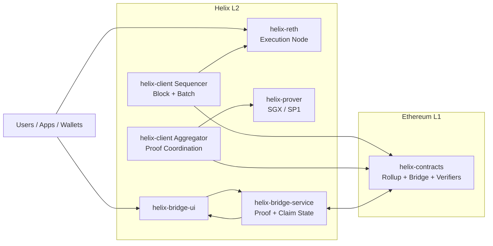

# Helix

Helix is an Ethereum-equivalent L2 rollup stack focused on **high throughput**, **modular architecture**, and **production-ready operations**.

## Highlights

- High-TPS execution path with `helix-reth`
- Typed transaction support: **EIP-1559 / 2930 / 4844**
- Flexible proving with **SGX / SP1**
- End-to-end bridge flow: **deposit / withdraw / verify / claim**
- Local E2E and Docker-based long-run operations

## Architecture

## Core Repositories

- `helix-contracts`
- `helix-reth`
- `helix-client`
- `helix-prover`
- `helix-bridge-service`
- `helix-bridge-ui`
