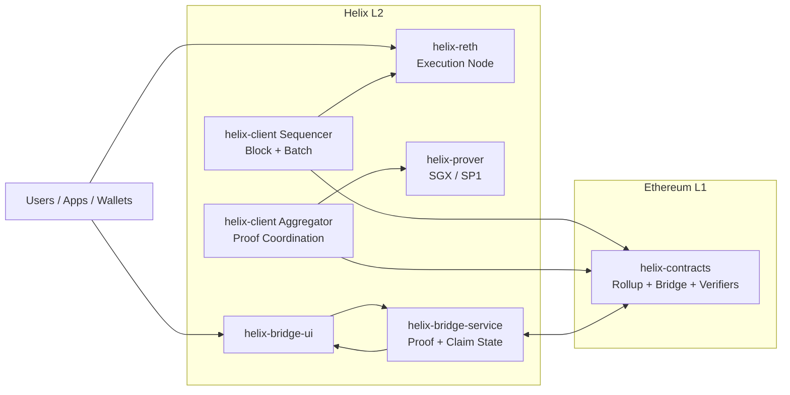

  

# Helix

Helix is an Ethereum-equivalent L2 rollup stack focused on **high throughput**, **modular architecture**, and **production-ready operations**.

## Highlights

- High-TPS execution path with `helix-reth`
- Typed transaction support: **EIP-1559 / 2930 / 4844**
- Flexible proving with **SGX / SP1**
- End-to-end bridge flow: **deposit / withdraw / verify / claim**
- Local E2E and Docker-based long-run operations

## Architecture

## How Helix Compares

| Dimension | Optimistic Rollups | Polygon zkEVM-style Stack | Helix |
|---|---|---|---|
| EVM equivalence | Typically not positioned as Type 1 | zkEVM compatibility with zk-driven constraints | **Type 1 EVM target (execution-equivalent path)** |
| Finality model | Fraud-proof challenge window | ZK proof verification | **Fast verification pipeline with SGX/SP1 options** |
| Throughput architecture | Good, but challenge model tradeoffs | Good, often prover-bound in practice | **High-TPS execution path + modular proving** |
| Proof strategy flexibility | Fraud-proof model | Primarily zk proving | **Multi-path proving: SGX + SP1 (zk proving path)** |
| Developer/Operator workflow | Mature but fragmented across stacks | Powerful but heavy zk operational surface | **One-command local deployment + E2E + Docker long-run workflow** |

Helix is built for teams that want **Type 1 EVM-level compatibility**, **high throughput**, and **proof-system flexibility** without being locked into a single proving path.
